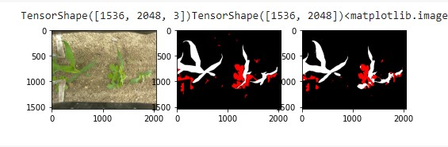

# Artificial Neural Network and Deep Learning Homeworks

### Image classification

Competition available on [Kaggle](https://www.kaggle.com/c/artificial-neural-networks-and-deep-learning-2020/overview).
We have created a CNN that discriminate between images depending on the following cases:
1) All the people in the image are wearing a mask
2) No person in the image is wearing a mask
3) Someone in the image is not wearing a mask. In the following 3 examples of image from the training belonging to the three cases

There are 2 models: One based on Transfer Learning on VGG19 model trained on ImageNet Dataset and a model trained from scratch, reaching maximum accuracy on test set of 0.895

### Image Segmentation

[ACRE](https://metricsproject.eu/agri-food/acre-competition/) is the Agri-food Competition for Robot Evaluation, part of the METRICS project funded by the European Union’s Horizon 2020 research and innovation program under grant agreement No 871252. Autonomous robots compete to demonstrate their ability to perform agricultural tasks (such as removing weeds or surveying crops down to individual-plant resolution). At field campaigns, participants collect data that are then made available for online competitions (Cascade Campaigns) like the one you are seeing. For more information about ACRE and METRICS visit the official website.

After years of decline, the number of undernourished people began to slowly increase again in 2015. Food Security requires that everyone can have enough food produced in a sustainable manner. The topic is increasingly gaining attention as food scarcity is worsened by a continuously growing population. Also, food production is threatened by climate change. The topic is so relevant that is part of one of the 17 Sustainable Development Goals of the UN 2030 Agenda. In particular, Food Security is a pillar of SDG number 2, Zero Hunger.

In this context, the agricultural sector is going under a process of revolution by the introduction of digital technologies. The Digital Agricultural Revolution can help to reduce the use of resources (water, fertilizers, and pesticides), thus diminishing the environmental contamination and the costs for the farmers. Also, it could increase the climate resilience of crops and their productivity.

Automatic crop and weed segmentation can be a driver of innovations to optimize the agricultural processes. Indeed, automatic weed detection can be exploited by a ground robot for mechanical weeding. Thus, pesticides could even be completely avoided. By joining this challenge you can contribute to advance the application of digital technologies in agriculture. 
<figure>

<figcaption>UNet Architecture</figcaption>
</figure>

There a 3 model in notebooks:
* Model based semplified version of U-Net, without Skip Connection
* Model based on U-Net
* Model based on FPN

The first model trained on <b>Tiled Images</b> of 224x224 give us a quite good result with global val_IoU = 0.49 over the 4 dataset available.

<figure>

<figcaption>Example of Validation set prediction. First Mask is the expected, the second one is the predicted</figcaption>
</figure>

